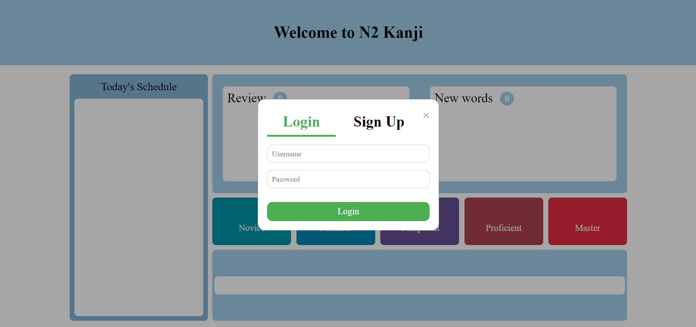
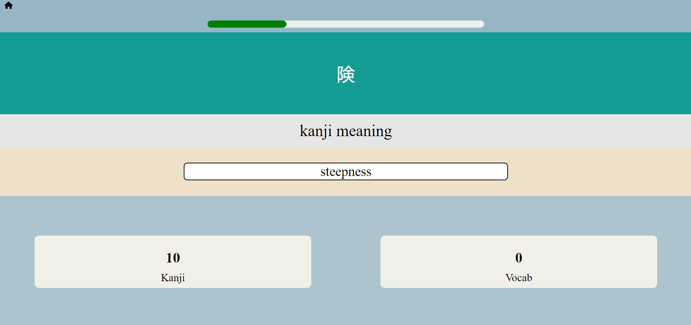
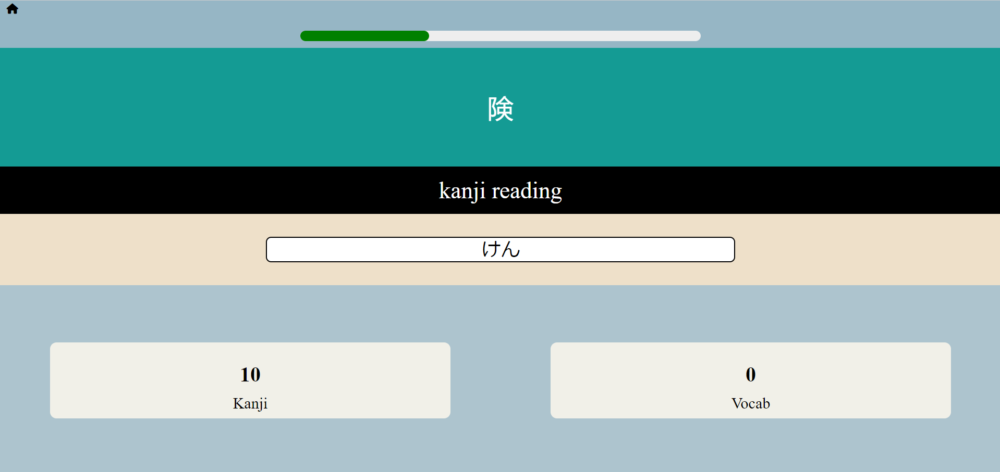

# SRS Japanese Flashcard Website
https://srs-japanese-flashcard-website.onrender.com

## Project Aim
The aim of this project was to create a flashcard website that utilised a Spaced Repition System (SRS) to allow users to learn the kanji required for the JLPT N2 exam (Advanced Japanese Proficiency Exam). This projects was inspired by the Japanese flashcard website, *wanikani*. However, the main difference between my project and *wanikani* is its focus, my project priotises the user learning **only** the kanji required for the exam.

## Technologies Used
- **Frontend**: HTML, CSS, JavaScript
- **Backend**: Node.js, Express.js
- **Database**: PostgreSQL (for storing flashcards, progress, and user data)
- **Authentication**: Bcrypt for password hashing
- **Session Storage**: Redis
- **Deployment**: Render

## Key Features
- **Spaced Repetition System (SRS)**: Optimises the review process by adjusting the interval between reviews based on previous answers.
- **Comprehensive Revision**: Users must recall both the reading and meaning of each kanji to strengthen their understanding.
- **Kanji Review Schedule**: Displays the number of kanji that are ready for review that day.
- **Progress Bar**: A visual progress bar during revision sessions to indicate how many kanji remain.
- **User Authentication**: Secure login and sign-up functionality with encrypted passwords using Bcrypt.
- **Multi-user Support**: Allows multiple users to create accounts and track their individual progress.

<table>
  <tr>
    <td></td>
    <td></td>
  </tr>
  <tr>
    <td></td>
    <td></td>
  </tr>
</table>

## Challenges
- **Deployment Issues**: At the start, the site faced issues with cookies not being sent properly when deployed on Render. After thorough investigation, it was discovered that Render used a reverse-proxy and Express was not trusting it and thus this was fixed.

